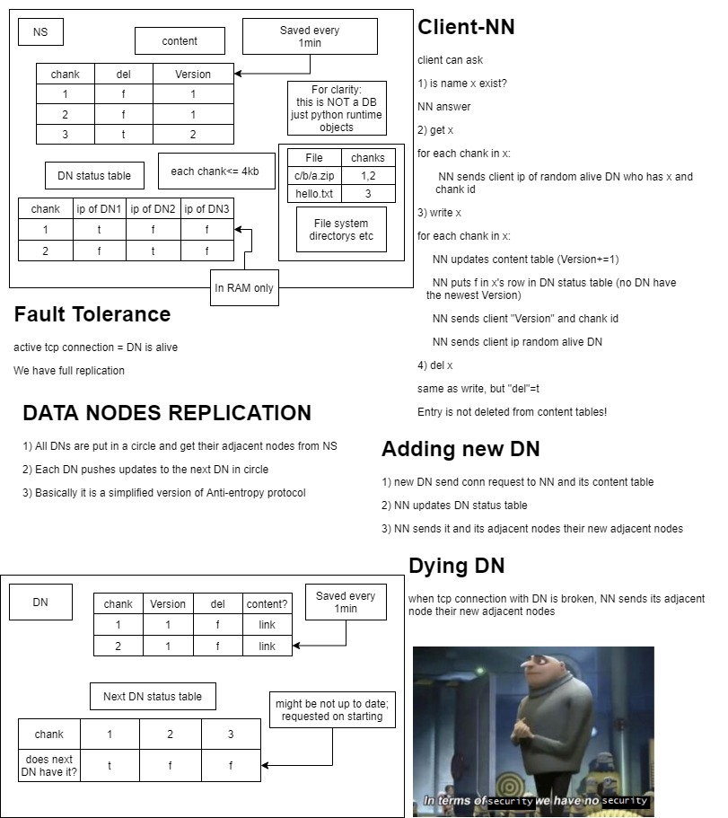

# Project 2
## How to launch
### Naming server
>docker run --env NN=\<ip of your NS here\> -p 8800-8810:8800-8810 andrey2/datanode:1.0 
### Data node
>docker run -p 8800-8810:8800-8810 andrey2/namingserver:1.0
### Clinet
git clone https://github.com/Andrey862/DS-Project-2 <br/>
cd Client
<br/>

python client.py
## Client commands
```
<NS_ip> ls .
<NS_ip> mkdir Foder_name
<NS_ip> rm File_name
<NS_ip> rm Folder_name
<NS_ip> write File_name
<NS_ip> read File_name
<NS_ip> ls . -r
```

## Architecture

## Contribution
Andrey | Magomed
------|------
Design | Naming server
Data Node | Client
Client | 